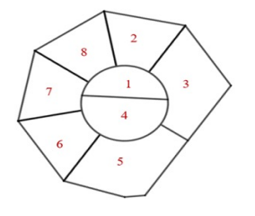
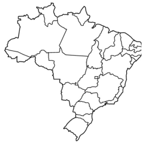
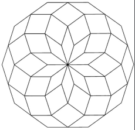

# Atividade de Inteligência Artificial: Implementação de Algoritmos de Busca em Grafos para Resolver o Teorema das 4 Cores

## Descrição
Este projeto é uma atividade acadêmica de Inteligência Artificial focada na implementação de algoritmos de busca em grafos para resolver o Teorema das 4 Cores. O objetivo é desenvolver uma solução que permita colorir qualquer grafo plano utilizando no máximo quatro cores, garantindo que nenhum vértice adjacente possua a mesma cor.

## Teorema das 4 Cores
O Teorema das 4 Cores estabelece que é possível colorir os vértices de qualquer grafo plano com no máximo quatro cores de modo que nenhum par de vértices conectados diretamente tenha a mesma cor. Este teorema é fundamental na teoria dos grafos e possui aplicações em diversas áreas, como cartografia e otimização.

## Estrutura do Repositório
- **/src**: Contém os códigos fonte dos algoritmos de busca e as implementações principais.
- **/instances**: Contém os arquivos de entrada que representam os grafos a serem resolvidos.
- **/images**: Contém as imagens dos grafos antes e depois da aplicação dos algoritmos.

## Padrões de commit
   - **FEAT**: Funcionalidade nova.
   - **REFACT**: Melhoria no código.
   - **FIX**: Correção no código.
   - **CHORE**: Alterações minimas sem impacto nas funcionalidades.

## Exemplos de Grafos Resolvidos
1. **Grafo 1**: [Imagem antes da resolução]

   

2. **Grafo 2**: [Imagem antes da resolução]

   

3. **Grafo 3**: [Imagem antes da resolução]

   

